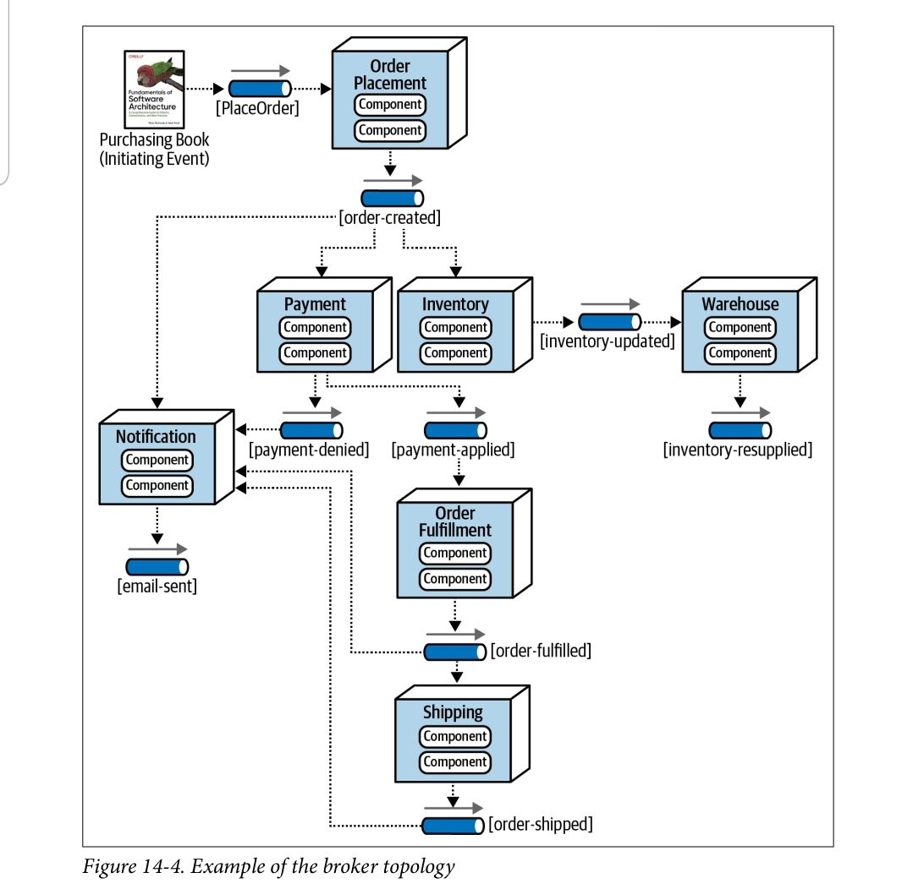

# 🧭 EDA Broker Architecture (Pure Java)

## 📌 Overview

This is a simple project demonstrating **Event-Driven Architecture (EDA)** using the **Broker Topology** pattern — implemented entirely with **pure Java**.

- ✅ Java version: **21**
- ✅ Easy to run: Just compile and run `Main.java`
- ✅ Educational: Ideal for learning by tweaking methods, constructors, and listeners — no frameworks involved.

---

## 💡 Features

- 🔄 Pure Java event broker with publish/subscribe system
- 🧠 Built-in validation using a WorkflowProcessor
- ❌ Handles invalid event data gracefully
- 🔁 Allows user to fix invalid input and resume event processing

---

## 📁 Project Structure


```
src/main/java/com/square/
├── brokers/           # Event bus: publish/subscribe logic
├── events/            # Event interface and event implementations
├── eventValidation/   # Validation interfaces and results
├── processor/         # Workflow processor to validate and resume events
├── services/          # Business logic and event listeners
└── Main.java          # Entry point for testing and demo
```

---

## 🗺️ Broker Topology (Architecture)

This project follows the **Broker Topology** pattern, as inspired by the _Software Architecture_ book. Here's a high-level view of the interaction:



---

## 🚀 Getting Started

1. **Clone the project**
   ```bash
   git clone https://github.com/HlyamHtetKyaw/eda-broker-architecture.git
   cd eda-broker-architecture

2. **Run the project**
 - Ensure you have Java 21 installed.
 - Compile and run using:
   ```bash
   javac src/main/java/com/square/Main.java
   java -cp src/main/java com.square.Main

## 🧪 Example Usage
   ```
   PlaceOrderEvent orderPlacedEvent = new PlaceOrderEvent(null,1L);
   broker.publish(orderPlacedEvent); // Fails validation
   orderPlacedEvent.setBookTitle("Software Architecture");
   broker.publish(orderPlacedEvent); // Resumes processing
   ```